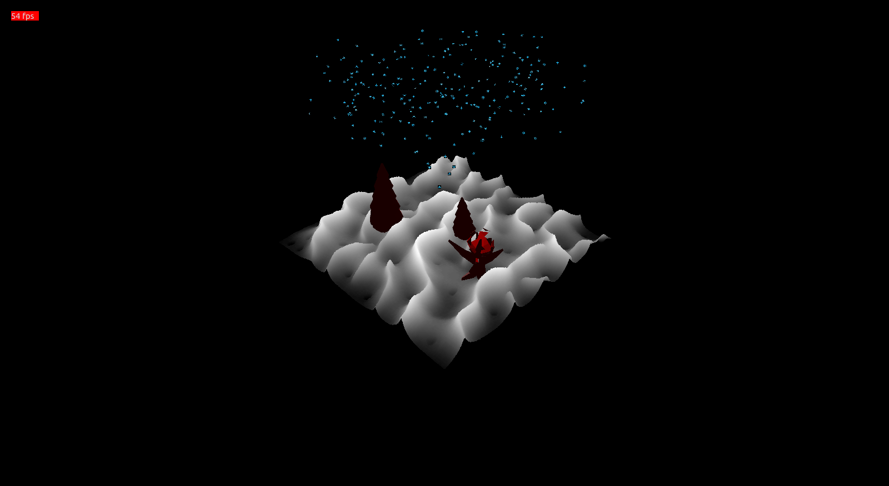
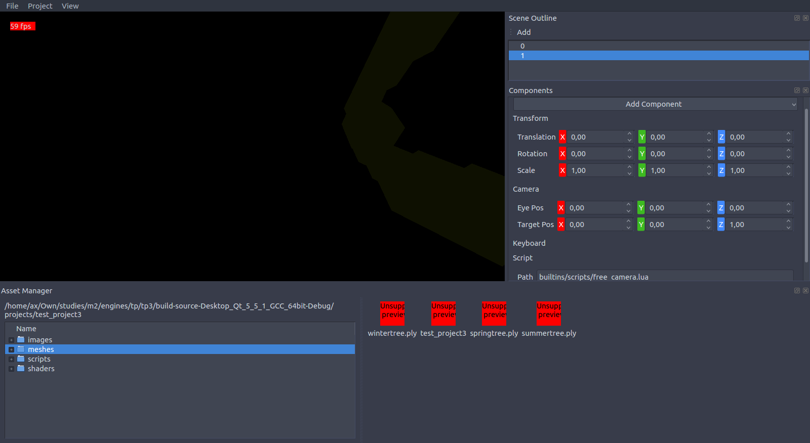

Moteurs de jeux : compte-rendu de TP3 et TP4
============================================




Abstraction autour d'OpenGL
---------------------------

Le moteur de rendu est divisé en deux niveaux :
- le partie haut-niveau définit des abstractions de haut niveau, indépendentes
de toute API graphique (essentiellement des abstractions de géométrie et de 
paramètres de shaders).
- celle de bas niveau interagit avec OpenGL.


ECS
---

J'ai intégré la bibliothèque `entityx` (https://github.com/alecthomas/entityx)
pour utiliser le pattern entités-composants-systèmes. Un objet dans le jeu 
n'est plus qu'une coquille vide, pouvant être agrémentée de plusieurs
composants. Pour l'instant, j'ai intégré des composants `Geometry`, `Mesh`,
`Material`, `ParticleEffect`, `Transform`, `Keyboard`, `Camera`, `Light` 
et `Script`.

L'abstraction OpenGL est suffisemment développée pour me 
permettre de décrire une scène en n'utilisant que des fonctions de haut niveau.

Exemple de placement des arbres dans la scène :
```cpp
    entityx::Entity treeEntity = scene.createEntity();
    treeEntity.assign<Mesh>("meshes/wintertree.ply");
    auto treeTransform = treeEntity.component<Transform>();
    treeTransform->setTranslate({300, -500, 0});
    treeTransform->setScale({100, 100, 100});
    treeTransform->setRotation({-90, 0, 0});

    entityx::Entity treeEntity2 = scene.createEntity();
    treeEntity2.assign<Mesh>("meshes/springtree.ply");
    auto treeTransform2 = treeEntity2.component<Transform>();
    treeTransform2->setTranslate({500, -350, 0});
    treeTransform2->setScale({80, 80, 80});
    treeTransform2->setRotation({-85, 0, 0});
```

(code complet dans `lab/seasons`)


Déroulement d'une itération du gameloop
---------------------------------------

- Le moteur lit les inputs de l'utilisateur.
- Les scripts du jeu sont exécutés.
- Le système des particules met à jour tous les effets de particules de la
scène.
- Le système de rendu déclenche un rendu. Le moteur de rendu détermine alors
les géométries ayant changé et nécessitant une mise à jour des buffers GPU, 
puis génère une liste de draw calls. Enfin, il dessine la scène à l'écran en 
utilisant cette liste.


Gestion des saisons
-------------------

Le but étant de réutiliser le code des TP afin de préparer au mieux le projet, 
j'ai préféré laisser pour l'instant la gestion des saisons à une classe
`SeasonController`, qui wrap un timer et les dates des quatre saisons. 

Le rendu selon une saison est défini par les uniforms passées aux shader
programs du terrain et des particules.

La classe SeasonController émet un signal `seasonChanged()` lorsque la saison courante a changé, ce qui déclenche un envoi des nouvelles uniforms aux shaders 
de la scène.

La partie abstraction me prenant beaucoup de temps, le rendu n'est actuellement 
pas particulièrement flatteur.


Systèmes de particules
----------------------

La classe `ParticleEffect` exploite le concept *Structure of Arrays*.

Chaque particule est définie dans un tableau de positions et dans un tableau de
vies.

La direction, la taille et la vitesse des particules est pour l'instant commune 
à toutes.

Le comportement est définit dans la méthode `ParticleSystem::live(dt)`. Les particules sont générées aléatoirement dans un rayon donné autour de la 
position du ParticleEffect. Lorsqu'une particule "meurt", elle est recyclée.

Un ParticleEffect ne contient que les positions de chaque particule : la 
géométrie d'une particule est générée par un geometry shader.


Modèles, textures et lumières
-----------------------------

J'ai utilisé la bibliothèque `assimp` pour charger des fichiers de modèles 3D.

La conversion des géométries vers mes classes `Geometry` et `Mesh` est 
implémentée.

L'import de matériaux n'est pas encore implémenté.

Actuellement, une lumière n'est définie que par sa position et sa couleur.
J'ai ajouté un matériau basique basé sur le lissage de Phong.


Moteur de script
----------------

J'ai ajouté un moteur de script LUA pour permettre d'itérer plus rapidement
pendant le développement du jeu.

Ce moteur utilise la bibliothèque `luabridge` pour faciliter l'exposition de
l'API C++ à LUA.


Bigfile
-------

Les assets d'un jeu peuvent être concaténés en un seul fichier binaire pour
réduire le nombre d'accès disque.

Pour cela, j'utilise le concept de "projet" : un projet est composé de
plusieurs dossiers (meshes, shaders, scripts...). La fonction de création de
bigfile prend en entrée un chemin de dossier (typiquement celui du projet) et
écrit un unique fichier .pak sur le disque. La hiérarchie des dossiers du projet
est conservée dans le bigfile.

La structure d'un bigfile est la suivante :
- nombre d'entrées dans le bigfile
- pour chaque entrée, 
    chemin de l'entrée + index de départ dans le bigfile + taille de l'entrée
- pour chaque entrée, 
    description binaire du fichier


La sauvegarde d'une scène est indépendente de la création du bigfile (voir 
ci-dessous).


Éditeur de scènes
-----------------

Un éditeur de scènes est en cours de développement, toujours pour permettre de
développer le jeu plus rapidement.

Actuellement, l'éditeur supporte les fonctionnalités suivantes :
- création de projet
- sauvegarde de projet et de la composition de la scène
- chargement de projet
- import d'assets
- création d'un bigfile composé des assets du projet
- ajout d'entités
- ajout de composants aux entités
- édition des propriétés des composants
- éditeur d'effets de particules
- un asset manager qui sait où trouver les assets, que ce soit en mode 
développement (les assets sont cherchés dans le dossier du projet) ou en mode 
jeu (les assets sont cherchés dans le bigfile).

La sauvegarde de la scène est relativement triviale puisqu'il suffit de
parcourir toutes les entités et de serialiser leurs composants.


